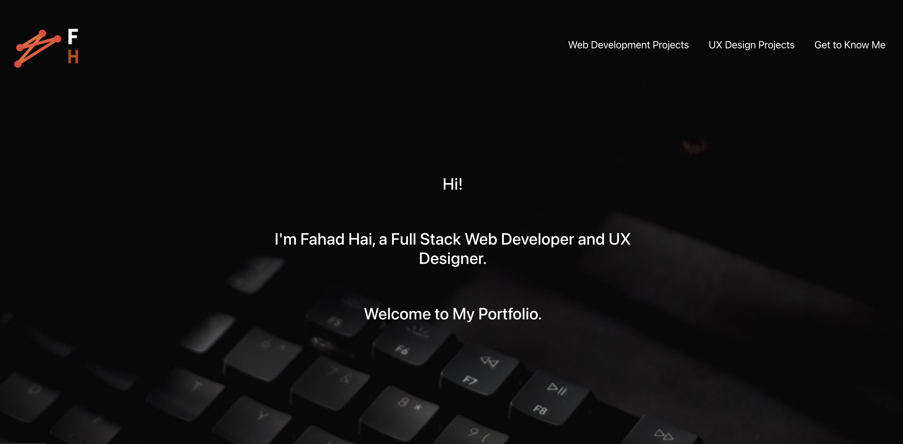

    <h3 align="center">My Portfolio</h3>
     
    

    A Full Stack Web Developer and UX Designer
     
     
    <a href="">View Demo</a>
    

    
Table of Contents

    <ol>
        <li><a href="#about-the-project">Description</a></li>
        <li><a href="#built-with">Built With</a></li></li>
        <li><a href="#installation">Installation</a></li>
        <li><a href="#usage">Usage</a></li>
        <li><a href="#contributing">Contributing</a></li>
        <li><a href="#license">License</a></li>
        <li><a href="#contact">Contact</a></li>
        <li><a href="#summary">Summary</a></li>
    </ol>

### Description

This is my portfolio, refactored to use REACT. Here you can learn more about me, as well as check out my projects for both web development and UX Design.

### Built With

Following languages, frameworks and libraries were used in the development of this project:

- HTML,CSS,JavaScript
- Bootstrap,REACT

### Installation

No installation required.

### Usage

Use the Navigation links to visit the section you want. You can also find my contact information on the "Get to know me" page.

### Contributing

Contributions are what make the open source community such an amazing place to learn, inspire, and create. Any contributions you make are **greatly appreciated**.

1. Fork the Project
2. Create your Feature Branch
3. Commit your Changes
4. Push to the Branch
5. Open a Pull Request

### License

This project is using the following license: UNLICENSE

### Contact

You can reach me for any questions or comments at the following:

- Look me up on Github, where my username is <a href="https://github.com/wdfhai">wdfhai</a>.
- Reach out to me through email at wd.fhai@outlook.com.
- Find me on Twitter at wdfhai.

### Summary

Thank you for visiting my portfolio. Reach out to me on the platform of your choice for any questions or comments. Cheers!
